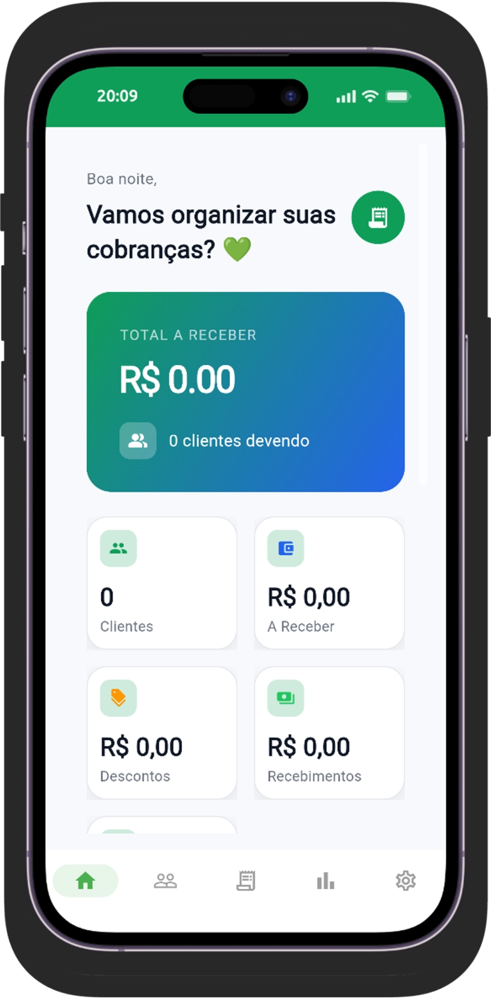
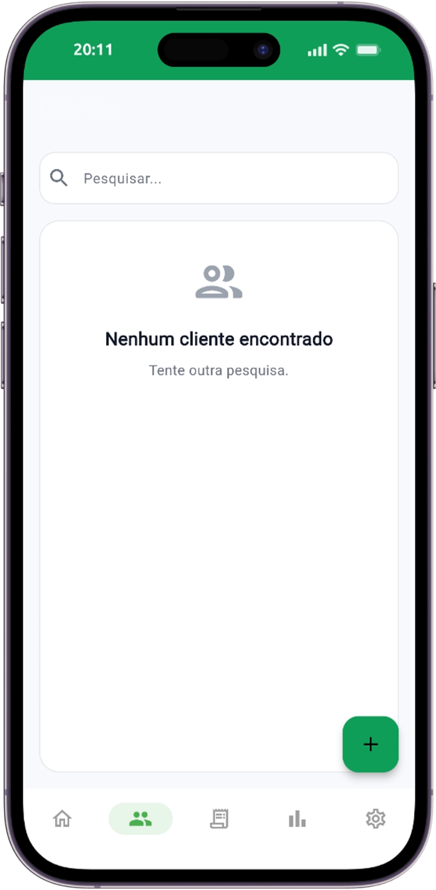
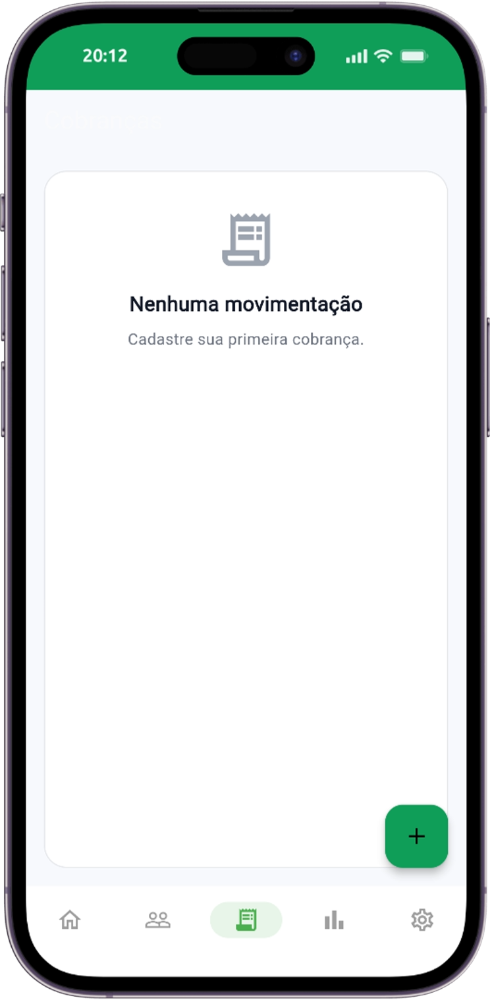
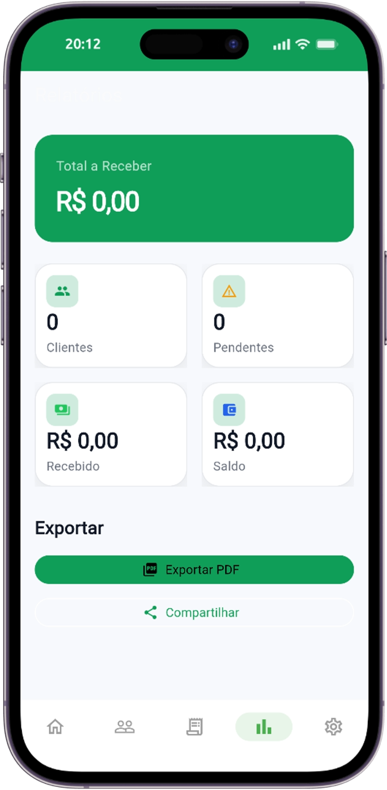
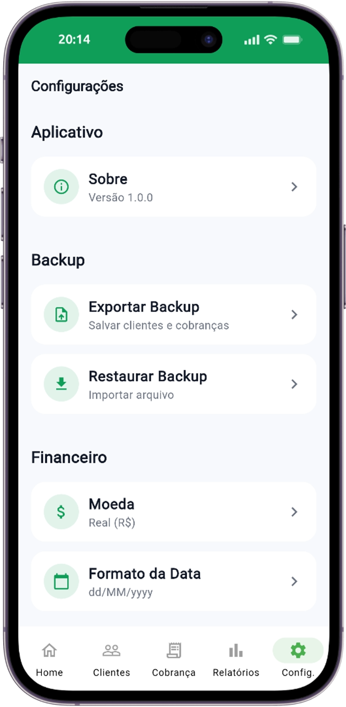

# 📝 Anotty

A modern and lightweight note-taking application built with **Flutter**. Anotty was designed to provide a fast, intuitive, and offline-first experience for creating, organizing, and sharing notes.

<p align="center">
  
</p>

## ✨ Features

- 📝 Create, edit and delete notes
- 🔍 Search notes instantly
- 📄 Export notes to PDF
- 📤 Share notes with other apps
- 💾 Offline storage using Hive
- 📱 Material 3 user interface
- ⚡ Fast and lightweight
- 📲 Google AdMob integration

---

## 📸 Screenshots

<p align="center">
  
</p>

<h1 align="center">📝 Anotty</h1>

<p align="center">
  A modern and lightweight note-taking application built with Flutter.
</p>

---

# 📸 Screenshots

<p align="center">
  
  
</p>

<p align="center">
  
  
</p>

<p align="center">
  
</p>

---

## 🛠️ Built With

- Flutter
- Dart
- Hive
- Flutter Material 3
- PDF
- Printing
- Share Plus
- Google Mobile Ads (AdMob)

---

## 📂 Project Structure

```text
lib/
 ├── core/
 ├── features/
 │    ├── home/
 │    ├── notes/
 │    ├── settings/
 │    └── shared/
 ├── services/
 └── main.dart
```

---

## 🚀 Getting Started

### Clone the repository

```bash
git clone https://github.com/SEU_USUARIO/anotty.git
```

### Enter the project

```bash
cd anotty
```

### Install dependencies

```bash
flutter pub get
```

### Run

```bash
flutter run
```

---

## 📦 Build

Android APK

```bash
flutter build apk --release
```

Android App Bundle

```bash
flutter build appbundle --release
```

---

## 📋 Requirements

- Flutter 3.x+
- Dart 3.x+
- Android Studio or VS Code

---

## 🤝 Contributing

Contributions are welcome!

Feel free to fork the project and submit a Pull Request.

---

## 📄 License

This project is licensed under the MIT License.

---

## 👨‍💻 Developer

Developed with ❤️ by **JeanDev**

Belém • Pará • Brazil 🇧🇷
